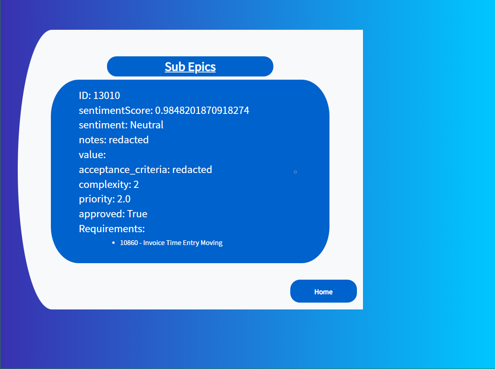

# Orai: Sprint Suggestions  

This web application is a recommendation engine built around project management data. It combines the querying power of the [Neo4j graph database](https://neo4j.com/) with the flexibility of the [Django web framework](https://www.djangoproject.com/) using the [django-neomodel plugin](https://github.com/neo4j-contrib/django-neomodel).

## Running the Application Locally
(Note: Currently, these instructions assume that you are running this using the Windows operating system)

### Set Up the Local Environment
First, ensure that you have Python 3.9 downloaded to your device. If you don't follow the instructions on the official download page [here](https://www.python.org/downloads/). You can double check that Python was installed correctly by typing `python --version` in the command line, which should return the version of Python you installed if you added it to your path. 

The default installation of Python includes pip, the standard package manager for Python. You can ensure that this is installed and up to date by typing `py -m pip install -U pip` in the command line. 

Once you've made sure that Python and pip are installed, you can clone the repository and start setting up the environment. Using a virtual environment is best practice, as it allows you to isolate the dependencies. 

To set up a virtual environment:

1. Change directory to wherever you cloned Orai `cd <path_to_orai>\Orai` 
2. Create the virtual environment with `python -m venv .\venv`
3. Start the virtual environment using `.\venv\Scripts\activate`

If this was successful, you should see something like `(venv) <path_to_orai>\Orai`. To deactivate the virtual environment, run the command `.\Scripts\deactivate`.

Now, you can add the necessary dependencies to the project. This can be done by using the requirements file:
`pip install -r requirements.txt`

The key dependencies are also listed below and can be installed individually by running `pip install <name>==<version>`:
```requirements.txt
Django==3.2.5
django-neomodel==0.0.7
neo4j-driver==4.3.1
neomodel==4.0.4
gunicorn==20.1.0
django-heroku==0.3.1
python-dotenv==0.19.2
```
### Connect to the Database
Now that the application is up and running, you need to connect to the database. Running this database locally requires Neo4j Desktop, which you can download [here](https://neo4j.com/download/). 

To load the database:

 1. Download the dump file from [here](https://drive.google.com/file/d/18v6ea16UnqW8dB9KP1bG7gaAN62_Oxbv/view?usp=sharing)
 2. Create a new project (or use the existing default project)
 3. Add a local DMBS, making sure to remember the password
 4. Click the three dots next to your newly created DBMS and open up the terminal
 5. Change to the `bin` directory using `cd bin`
 6. Load the database from the dump file by running `neo4j-admin load --from C:\path\to\orai-2021-12-3.dump` 
 

Now, you can start the DBMS. To connect the database to the application, we need to create a file that Orai will read environment variables from create a file called `.env` at the base directory. in it copy the following replacing anything in `<your_password_here>` with the password you set up in the neo4j gui.
```dotenv
NEO4J_USERNAME=neo4j
NEO4J_PASSWORD=<your_password_here>
NEO4J_SERVER=localhost
NEO4J_PORT=7687
```

Once this is done, go back to the command line and use `python manage.py runserver` to run the development server. If everything was done correctly, you should be able to go to http://127.0.0.1:8000/ to see the application. 

## Application Features


_________


_________


_________


_________


## Built With

* HTML, CSS, Javascript
* [Django](https://www.djangoproject.com/)
* [Neo4j](https://neo4j.com/)
* [django-neomodel](https://github.com/neo4j-contrib/django-neomodel)

## Authors

* Felix Medrano
* Valentina Diaz
* Jacob Christensen

## Acknowledgments

* The [Paradise Papers Django project](https://github.com/neo4j-examples/paradise-papers-django), which served as a model for our own application
* The Silver Logic for sponsoring this project and giving us support all the way through


